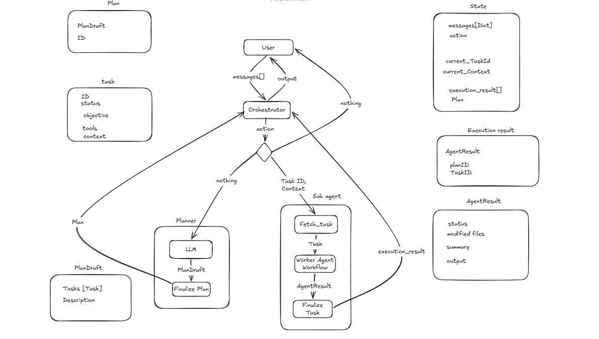

# NeoZephyr

NeoZephyr is an open-source **AI coding and general-purpose agent** inspired by tools such as **Claude Code**, **Codex**, and other agentic development systems.

Rather than relying on a single monolithic prompt, NeoZephyr follows a **planner–executor architecture** where an orchestration layer decomposes user requests into executable tasks and delegates them to specialized workflows. This separation makes the agent easier to extend, more reliable, and significantly more token-efficient for long-running sessions.

---

## Features

- **Planning-based execution**
  - Breaks complex requests into small executable tasks.
  - Executes one task at a time.
  - Supports dynamic replanning when needed.

- **Agentic workflow**
  - Orchestrator coordinates execution.
  - Planner generates execution plans.
  - Worker executes tasks using a restricted subset of tools.

- **Tool sandboxing**
  - Every task only receives the tools required to complete it.
  - Workers cannot access tools that were not assigned by the orchestrator.

-  **Execution history**
  - Keeps track of completed tasks and their outputs.
  - Allows future decisions to reuse previous discoveries.

-  **Tool Calling**
  - Uses native OpenAI/OpenRouter function calling instead of parsing free-form text.
  - Structured communication between every component.

- **Extensible**
  - New tools can be added through the `ToolRegistry`.
  - Additional agents or workflows can easily be introduced.

---

## Architecture

NeoZephyr is composed of three main components.

### Orchestrator

The Orchestrator is the brain of the system.

Its responsibilities include:

- Understanding the user's request.
- Deciding whether a plan is needed.
- Selecting the next task to execute.
- Providing context to the worker.
- Monitoring execution progress.
- Returning progress updates to the user.
- Determining when the objective has been completed.

The Orchestrator **never modifies code directly**.

---

### Planner

The Planner converts high-level objectives into executable plans.

It generates a **PlanDraft**, which is then finalized into a persistent execution plan.

Each task contains:

- Objective
- Allowed tools
- Context
- Status
- Unique identifier

The planner may also regenerate an existing plan if execution reveals that the current plan is no longer valid.

---

### Worker

The Worker is responsible for executing individual tasks.

Each task is executed inside its own workflow.

Before execution, the worker receives:

- the task objective
- task context
- only the subset of tools assigned by the orchestrator

This prevents unauthorized tool usage and keeps each execution focused.

---

## Execution Flow

```
User
   │
   ▼
Orchestrator
   │
   ├── Create Plan
   ▼
Planner
   │
Plan
   │
   ▼
Worker
   │
Execute Task
   │
Execution Result
   │
   ▼
Orchestrator
   │
Repeat until objective is completed
```

The complete architecture is illustrated below.



---

## Tool System

NeoZephyr uses a centralized **ToolRegistry**.

Each tool consists of:

- OpenAI tool definition
- Python implementation

The registry allows:

- listing available tools
- creating subsets for workers
- executing tools safely
- validating tool permissions

Current built-in tools include:

| Tool | Description |
|------|-------------|
| Read | Read file contents |
| Edit | Create or modify files |
| Bash | Execute shell commands |
| Glob | Search files using patterns |
| Grep | Search inside files |

Adding new tools only requires registering them in the registry.

---

## Installation

### 1. Clone the repository

```bash
git clone <repository-url>
cd NeoZephyr
```

### 2. Create a virtual environment

```bash
python -m venv .venv
```

### 3. Activate the environment

**Linux/macOS**

```bash
source .venv/bin/activate
```

**Windows**

```bash
.venv\Scripts\activate
```

### 4. Install NeoZephyr

```bash
pip install -e .
```

This installs the `neo` command, allowing NeoZephyr to be launched from any directory.

### 5. Configure OpenRouter

Create a `.env` file in the project root.

```env
OPENROUTER_API_KEY=your_api_key_here
```

An API key can be obtained from:

https://openrouter.ai

---

## Usage

Launch NeoZephyr from any directory.

```bash
neo
```

---

## Project Structure

```
neozephyr/
│
├── agents/
│   ├── orchestrator.py
│   ├── planner.py
│   └── worker.py
│
├── tools/
│   ├── read.py
│   ├── write.py
│   ├── coordination.py
│   └── ...
│
├── models.py
├── prompts.py
└── main.py
```

---

## Current Status

NeoZephyr is actively under development.

Current capabilities include:

- Planning
- Task orchestration
- Tool calling
- Worker workflows
- Structured outputs
- Execution history
- Repository exploration
- Code editing
- Shell execution

Future work includes:

- Parallel task execution
- Long-term memory
- MCP support
- Remote execution
- Additional built-in tools
- Multi-repository workflows

---